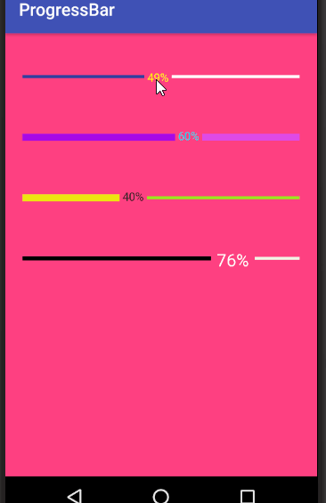
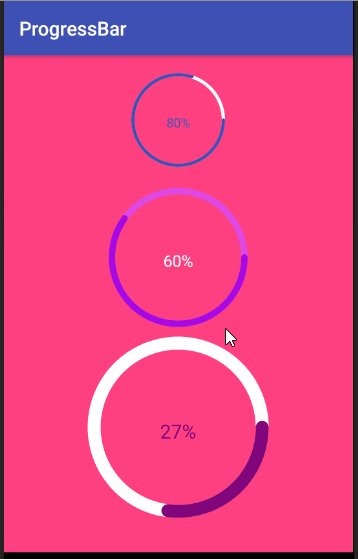
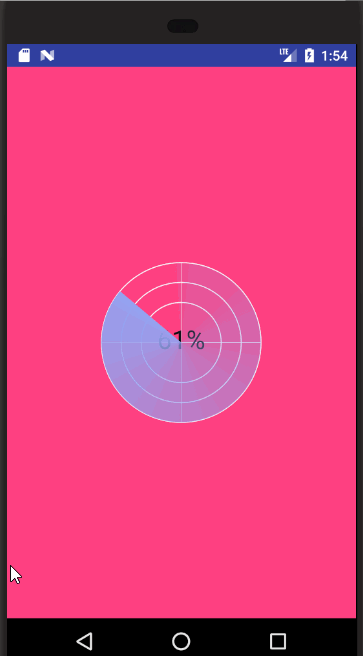
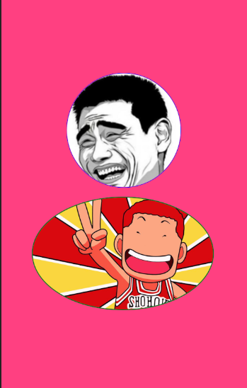

# CustomViewTrain
## 记录自定义View的学习的项目,欢迎大家和我交流学习,喜欢麻烦给个Star鼓励一下,谢谢!

[]()   []()   []()

## [viewdraghelper(辅助类)](https://github.com/kevin321happy/CustomViewTrain/tree/master/viewdraghelper/src/main/java/com/wh/jxd/com/viewdraghelper)

#### -  自定义View中常用的五个辅助类,包括手势识别,速度追综，拖拽，滑动,设备信息等

## [自定义ProgressBar](https://github.com/kevin321happy/CustomViewTrain/blob/master/progressbar/src/main/java/com/wh/jxd/com/progressbar/widget)
<a href="gif/hprogress.gif"><a href="gif/ringprogress.gif">

#### - [水平的进度条](https://github.com/kevin321happy/CustomViewTrain/blob/master/progressbar/src/main/java/com/wh/jxd/com/progressbar/widget/HorizontalProgress.java),支持已达到进度未到达进度的颜色高度定制,进度文字的颜色大小以及左右边距的定制，还能拖动改变进度。
#### [圆环进度条](https://github.com/kevin321happy/CustomViewTrain/blob/master/progressbar/src/main/java/com/wh/jxd/com/progressbar/widget/RingProgress.java)圆环的宽度,颜色,环背景,以及中间文字的相关属性设置
```xml
    <!--水平进度条的自定义属性-->
       <declare-styleable name="HorizontalProgress">
           <!--已到达的进度的颜色-->
           <attr name="HorProgressReacherColor" format="color" />
           <!--已到达的进度高度-->
           <attr name="HorProgressReacherHeight" format="dimension" />
           <!--未到达的进度的颜色-->
           <attr name="HorProgressUnReacherColor" format="color" />
           <!--未到达的进度的高度-->
           <attr name="HorProgressUnReacherHeight" format="dimension" />
           <!--进度文字的颜色-->
           <attr name="HorProgressTextColor" format="color" />
           <!--进度文字的大小-->
           <attr name="HorProgressTextSize" format="dimension" />
           <!--进度文字的左右边距-->
           <attr name="HorProgressTextMargin" format="dimension" />
       </declare-styleable>

       <!--环形进度条的自定义属性-->
           <declare-styleable name="RingProgress">
               <!--已到达的进度的颜色-->
               <attr name="RingProgressRearchColor" format="color" />
               <!--未达到的进度的颜色-->
               <attr name="RingProgressUnRearchColor" format="color" />
               <attr name="RingWidth" format="dimension" />
               <!--进度文字的颜色-->
               <attr name="RingProgressTextColor" format="color" />
               <!--进度文字的大小-->
               <attr name="RingProgressTextSize" format="dimension" />
           </declare-styleable>
```
------------

## [仿华为天气的日出控件](https://github.com/kevin321happy/CustomViewTrain/blob/master/bezierview/src/main/java/com/wh/jxd/com/bezierview/widget/HweatherWidget.java)
   
#### - 仿华为天气里面的日出的空间,随着时间的移动改变太阳在圆弧上面的位置,动画效果
-主要通过属性动画的线性变化的值得到0~目标进度的中间值,重绘形成动画效果
```java
private void initAnimation() {
        mAnimator = ValueAnimator.ofFloat(0, 1);
        mAnimator.setDuration(5000);
        mAnimator.setInterpolator(new AccelerateDecelerateInterpolator());
        mAnimator.addUpdateListener(new ValueAnimator.AnimatorUpdateListener() {
            @Override
            public void onAnimationUpdate(ValueAnimator animation) {
                mAnimatedValuevalue = (float) animation.getAnimatedValue();
                if (mAnimatedValuevalue > mProgress) {
                    mAnimatedValuevalue = mProgress;
                }
                upDataDraw();
            }
        });
    }
```
```java
        /**
         * 绘制第二条路径
         *
         * @param canvas
         */
        private void drawSecondArc(Canvas canvas) {
            float sweepAngle = 180 * mAnimatedValuevalue;
            mRectF = new RectF(mPadding, mPadding, mWidth - mPadding, mWidth - mPadding);
            canvas.drawArc(mRectF, 180, sweepAngle, false, mSecondArcPaint);
        }
```
------------

## - [仿华为管家病毒检查控件](https://github.com/kevin321happy/CustomViewTrain/blob/master/bezierview/src/main/java/com/wh/jxd/com/bezierview/widget/CheckVirusView.java),一个雷达扫描的效果,还有是在扫描过程中随机生成圆形斑点
#### - 随机斑点的显示是通过在子线程延迟绘制,这种实现效果可能不是很好,如果大家有更好的思路也欢迎大家给我提Issues

<a href="gif/checkvirusView.gif">
------------

## [仿华为管家刻度进度盘](https://github.com/kevin321happy/CustomViewTrain/blob/master/bezierview/src/main/java/com/wh/jxd/com/bezierview/widget/CircleProgressPlate.java)
 <div align="center">
    
    
  </div>

#### - 仿华为手机管家的[圆盘刻度控件](https://github.com/kevin321happy/CustomViewTrain/blob/master/bezierview/src/main/java/com/wh/jxd/com/bezierview/widget/CircleProgressPlate.java),支持刻度线颜色长度,以及中间文字的相关属性定制,能设置动画插值器来改变进度的动画
#### 还能通过改变属性设置是否需要扫描的效果,扫描的动画效果
```xml
    <!--刻度进度盘的自定义属性-->
       <declare-styleable name="CircleProgressPlate">
           <!--刻度线长度-->
           <attr name="PlatScaleLngth" format="dimension" />
           <!--刻度的颜色-->
           <attr name="PlatScaleColor" format="color" />
           <!--画笔的描边的宽度-->
           <attr name="PlatStrokeWidth" format="dimension" />
           <!--外圈圆颜色mOutRingColor-->
           <attr name="PlatOutCircleColor" format="color" />
           <!--文字的颜色-->
           <attr name="PlatTextColr" format="color" />
           <!--是否需要扫描-->
           <attr name="PlatShouldScan" format="boolean" />
           <!--扫描的颜色-->
           <attr name="PlatScanColor" format="color" />
       </declare-styleable>
```
------------

## [贝塞尔控件](https://github.com/kevin321happy/CustomViewTrain/tree/master/bezierview/src/main/java/com/wh/jxd/com/bezierview)
#### - [1-3阶贝塞尔](https://github.com/kevin321happy/CustomViewTrain/blob/master/bezierview/src/main/java/com/wh/jxd/com/bezierview/widget/LowOderBezierPath.java) 直接调用系统提供的api，
```java
    @Override
       protected void onDraw(Canvas canvas) {
           super.onDraw(canvas);
           //一阶贝塞尔
           mPath.moveTo(200, 200);
           mPath.lineTo(500, 400);
           //二阶贝塞尔
           /**
            * 绝对绘制
            * 控制钱的坐标和结束点的坐标
            */
   //        mPath.quadTo(600,0,800,400);
           /**
            * 相对位置绘制
            * 600相对500是100,0相对400是-400,800相对500是300,400相对400是0
            * 所以控制点相对的x ，y 为100,-400   结束点的相对 x ，y是 300,0
            */
           mPath.rQuadTo(100,-400,300,0);
           //三阶贝塞尔
           mPath.moveTo(400,800);
           /**
            * 控制点1  x,y坐标
            * 控制点2 x,y坐标
            * 结束点的 x,y坐标
            */
           mPath.cubicTo(500,400,700,1200,1000,800);
           /**
            * 相对位置绘制发,各个点的x，y值分别相对起始点的，y的值
           */
           mPath.moveTo(400,1000);
           mPath.rCubicTo(100,-400,300,400,600,0);
           canvas.drawPath(mPath,mPaint);
       }
```
#### -[高阶贝塞尔](https://github.com/kevin321happy/CustomViewTrain/blob/master/bezierview/src/main/java/com/wh/jxd/com/bezierview/widget/HeightOderBezierPath.java)根据规律实现高级贝塞尔绘制
-主要是计算贝塞尔点的规则:
```java
    /**
        * 计算某时刻贝塞尔点的值 x,或y的值
        * t 0-1
        * values贝塞尔点的x，y的集合
        * 算法规则：
        * 相邻两个点之间根据贝塞尔公式两两运算,运算的结果存在前面一个值中
        * 没运算一轮就减少一个点(那一轮的在最后的一个点)
        * 通过双重循环到最后计算得到的值存贮在了数组中的0元素
        */
       private float calculatePoint(float t, float... values) {
           int length = values.length;
           for (int i = length - 1; i >= 0; i--) {
               for (int j = 0; j < i; j++) {
                   //根据上一个点的位置得到下一个点
                   values[j] = values[j] + (values[j + 1] - values[j]) * t;
               }
           }
           //运算时的的结果永远保存在第一位
           return values[0];
       }
```
#### -  [曲线的填充效果](https://github.com/kevin321happy/CustomViewTrain/blob/master/bezierview/src/main/java/com/wh/jxd/com/bezierview/widget/HeightOderBezierPath.java)
   

-主要实现是绘制两条路径相同的线,第二条Path在计算路径的时候在for循环中根据规则动态计算各个点坐标
```java
 private void initBezier() {
        mBgpath.moveTo(0,600);
        float[] xPonits = new float[]{0,200, 800, 1000};
        //y点坐标的数组
        float[] yPonits = new float[]{600,0, 1200, 0};
        mBgpath.cubicTo(200,0,800,1200,1000,0);
        //进度t值为0.2的时候
//        float progress = 0.2f;
        //循环刷新的次数,当值足够大,连起来的点就会是一个平滑的曲线了
        int fps = 10000;
        for (int i = 0; i < fps; i++) {
            float t = i / (float) fps;
            float x = calculatePoint(t, xPonits);
            float y = calculatePoint(t, yPonits);
            //path连接的方式
            mPath.lineTo(x, y);
            //刷新
            postInvalidate();
            try {
                Thread.sleep(10);
            } catch (InterruptedException e) {
                e.printStackTrace();
            }
            Log.i("path", "path的当前点:" + x + "," + y);
        }
//        calculatePoint(progress,xPonits);
    }
```
#### -  自定义的[下拉粘性控件](https://github.com/kevin321happy/CustomViewTrain/blob/master/bezierview/src/main/java/com/wh/jxd/com/bezierview/widget/PullViscousView.java)

   

-可设置中间的Drawable的显示,以及颜色半径等基础属性设置
```xml
     <!--粘性下拉控件的自定义属性-->
        <declare-styleable name="PullViscousView">
            <!--下拉的最大距离-->
            <attr name="PullViewPullDownMaxHeight" format="dimension"></attr>
            <!--控件的颜色-->
            <attr name="PullViewColor" format="color" />
            <!--圆的半径-->
            <attr name="PullViewCircleRadius" format="dimension" />
            <!--切线角的最大角度-->
            <attr name="PullViewTangentAngle" format="integer" />
            <!--拉到最低点时控件的宽度-->
            <attr name="PullViewTargetWidth" format="dimension" />
            <!--控件下移的高度-->
            <attr name="PullViewDownHeight" format="dimension" />
            <!--中间内容的外边距-->
            <attr name="PullViewContentMargin" format="dimension" />
            <!--中间圆显示的drawable-->
            <attr name="PullViewCentreDrawable" format="reference" />
        </declare-styleable>
```
-在控件所在的根布局中重写根布局的触摸事件,根据下来的高度得到进度至,然后去实现控件下拉
```java
       /**
        * 根布局的触摸监听
        * @param v
        * @param event
        * @return
        */
       @Override
       public boolean onTouch(View v, MotionEvent event) {
           switch (event.getAction()) {
               case MotionEvent.ACTION_DOWN:
                   mStartX = event.getX();
                   mStartY = event.getY();
                   return true;
               case MotionEvent.ACTION_MOVE:
                   float endY = event.getY();
                   float endX = event.getX();
                   //下拉的距离
                   float distance = endY - mStartY;
                   //下拉的高度除以定义的允许的最大高度可以得到一个进度值
                   float progress = distance >= ALLOW_PULL_MAXHEIGHT ? 1 : distance / ALLOW_PULL_MAXHEIGHT;

                   if (mPull_viscous_view != null) {
                       mPull_viscous_view.setProgress(progress);
                   }
                   return true;
               case MotionEvent.ACTION_UP:
                   //当Up的时候控件回弹回去
                   mPull_viscous_view.pringbBack();
                   break;
           }
           return false;
       }
```
-根据进度可以得到圆心坐标和切线角度,绘制两边的贝塞尔曲线核心是根据圆心坐标和切线角运用三角函数动态的计算结束点和控制点
```java
 /**
     * 更新Path的路径
     */
    private void upDataPathLayout() {
        float progress = mProgressInterpolator.getInterpolation(mProgress);
        //获取当前的宽度和高度
        float width = getValueByLine(getWidth(), mTargetWidth, mProgress);
        float height = getValueByLine(0, mAllowMaxHeight, mProgress);
        //确定圆的相关参数
        float cPonitX = width / 2;
        float cPonitY = height - mCircleRadius;
        float cRedius = mCircleRadius;
        //更新圆心的位置
        mCirclePointX = cPonitX;
        mCirclePointY = cPonitY;
        //控制点结束位置的坐标
        int endContralY = mDownHeight;
        Log.i("X", "回调进来的进度:" + progress + "圆心的坐标:" + mCirclePointX + "," + mCirclePointY);
        mPath.reset();
        mPath.moveTo(0, 0);
        //计算控制点和结束点的位置
        //左边控制点的高度
        float lControlPointX, lControlPointY;
        //左边结束点的x,y
        float lEndx, lEndy;
        //获取切线角的弧度(将角度变成弧度)
        double radians = Math.toRadians(getValueByLine(0, mTangentAngl, progress));
        //结束点的X的坐标为圆心的X坐标-半径*sin（radians）
        lEndx = (float) (cPonitX - Math.sin(radians) * cRedius);
        //结束点的Y坐标等于圆心位置的y坐标+半径*cos(cRedius)
        lEndy = (float) (cPonitY + Math.cos(radians) * cRedius);
        //控制的y坐标
        lControlPointY = getValueByLine(0, endContralY, progress);
        //控制点和结束点之前的相差的高度
        float diffHeight = lEndy - lControlPointY;
        //可以根据两点相差的高度,和切线角度求出两点之间x的差值
        float diffWidth = (float) (diffHeight / Math.tan(radians));
        //得到控制点的X坐标
        lControlPointX = lEndx - diffWidth;
        mPath.quadTo(lControlPointX, lControlPointY, lEndx, lEndy);
        //将path左象平移一段至cPonitX+(cPonitX-lEndx)
        mPath.lineTo(cPonitX + (cPonitX - lEndx), lEndy);
        //绘制右边的贝塞尔曲线
        mPath.quadTo(cPonitX + cPonitX - lControlPointX, lControlPointY, width, 0);
        upDataContentLayout(cPonitX, cPonitY, cRedius);
    }
```

------------
## [侧滑菜单](https://github.com/kevin321happy/CustomViewTrain/tree/master/sidemenuview)
   

#### -  侧拉删除,处理菜单视图的回弹动画和关闭菜单动画,支持菜单视图的定制
-通过属性动画实现回弹效果的处理
```java
 /**
     * 平滑的滑到到结束位置
     *
     * @param distanceX
     */
    private void smoothToEnd(final int distanceX) {
        ValueAnimator valueAnimator;
        if (distanceX > mMenuWidth / 2) {
            //动画的初值和结束值
            valueAnimator = ValueAnimator.ofInt(getScrollX(), mMenuWidth);
        } else {
            valueAnimator = ValueAnimator.ofInt(getScrollX(), 0);
        }
        valueAnimator.addUpdateListener(new ValueAnimator.AnimatorUpdateListener() {
            @Override
            public void onAnimationUpdate(ValueAnimator animation) {
                scrollTo((Integer) animation.getAnimatedValue(), 0);
            }
        });
        //设置动画插值器,开始慢后面变快
        valueAnimator.setInterpolator(new AccelerateInterpolator());
        valueAnimator.setDuration(500).start();
        valueAnimator.addListener(new Animator.AnimatorListener() {
            @Override
            public void onAnimationStart(Animator animation) {

            }

            @Override
            public void onAnimationEnd(Animator animation) {
                //超过了二分之一的子菜单宽度则是展开的状态,反之则为关闭
                if (distanceX > mMenuWidth / 2) {
                    mExpand = true;
                } else {
                    mExpand = false;
                }
            }

            @Override
            public void onAnimationCancel(Animator animation) {

            }

            @Override
            public void onAnimationRepeat(Animator animation) {

            }
        });
    }

```

------------

## [带圆角的ImageView](https://github.com/kevin321happy/CustomViewTrain/tree/master/roundimageview/src/main)
 <a href="roud03.png"></a> <a href="gif/roud02.png"></a> <a href="roud01.png"></a>

#### -  自定义带圆角的ImageView,可以随意设置ImageView四个角的圆角,还能通过属性调整显示为圆形和椭圆,还支持描边的颜色宽度设置
```xml
<!--圆角图片的自定义属性-->
    <declare-styleable name="RoundImage">
        <!--左上的圆角-->
        <attr name="roundImageLeftTopRadius" format="dimension" />
        <!--右上的圆角-->
        <attr name="roundImageRightTopRadius" format="dimension" />
        <!--左下的圆角-->
        <attr name="roundImageLeftBottomRadius" format="dimension" />
        <!--右下的圆角-->
        <attr name="roundImageRightButtomRadius" format="dimension" />
        <!--整体圆角-->
        <attr name="roundImageRadius" format="dimension" />
        <!--描边的宽度-->
        <attr name="roundImageStrokeWidth" format="dimension" />
        <!--描边的颜色-->
        <attr name="roundImageStrokeColor" format="color" />
        <!--是否显示圆形-->
        <attr name="roundImageCyclo" format="boolean" />
    </declare-styleable>
 ```
------------

## [自定义圆形的Viewpager指示器](https://github.com/kevin321happy/CustomViewTrain/tree/master/circleindicator/src/main/java/com/wh/jxd/com/circleindicator)

   

#### -  通用的Viewpager指示器,支持颜色,大小,间距设置,还支持圆点中心显示数字,字母等定制
```xml
 <!--自定义指示器的自定义属性-->
    <declare-styleable name="CircleIndicator">
        <!--半徑-->
        <attr name="indicatorRadius" format="dimension" />
        <!--画笔的颜色-->
        <attr name="indicatorColor" format="color" />
        <!--间距-->
        <attr name="indicatorSpace" format="dimension" />
        <!--环的宽度-->
        <attr name="indicatorBorderWidth" format="dimension" />
        <!--环的中间的文字的颜色-->
        <attr name="indicatorTextColor" format="color" />
        <!--环的填充模式(数字、字母、纯色)-->
        <attr name="indicatorFillMode" format="integer" />
    </declare-styleable>
```
------------

## [雷达扫描](https://github.com/kevin321happy/CustomViewTrain/tree/master/radarscanview/src/main)

#### -  仿雷达扫描功能,提供颜色,大小,中间文字信息的设置,可手动控制开始停止

   

------------

## [动感圆环](https://github.com/kevin321happy/CustomViewTrain/tree/master/ringwave/src)

#### -  随着手指的按下和移动能有圆环的效果,圆环的渐变色,透明,缩放动画.看起来有点骚气,可惜实际好像没什么卵用...

   

------------

## [流式标签](https://github.com/kevin321happy/CustomViewTrain/tree/master/flowviewsample/src/main)

#### -  自动换行的流式标签,功能做的很简陋,主要在onMeasure和onLayout中处理实现流式摆放的效果


------------

## [收缩布局](https://github.com/kevin321happy/CustomViewTrain/tree/master/collapseviewsample/src)

#### -  手动实现类似ExpandableListView展开收缩的效果,同事展开收缩的动画效果


------------

## 未完待续....


 


